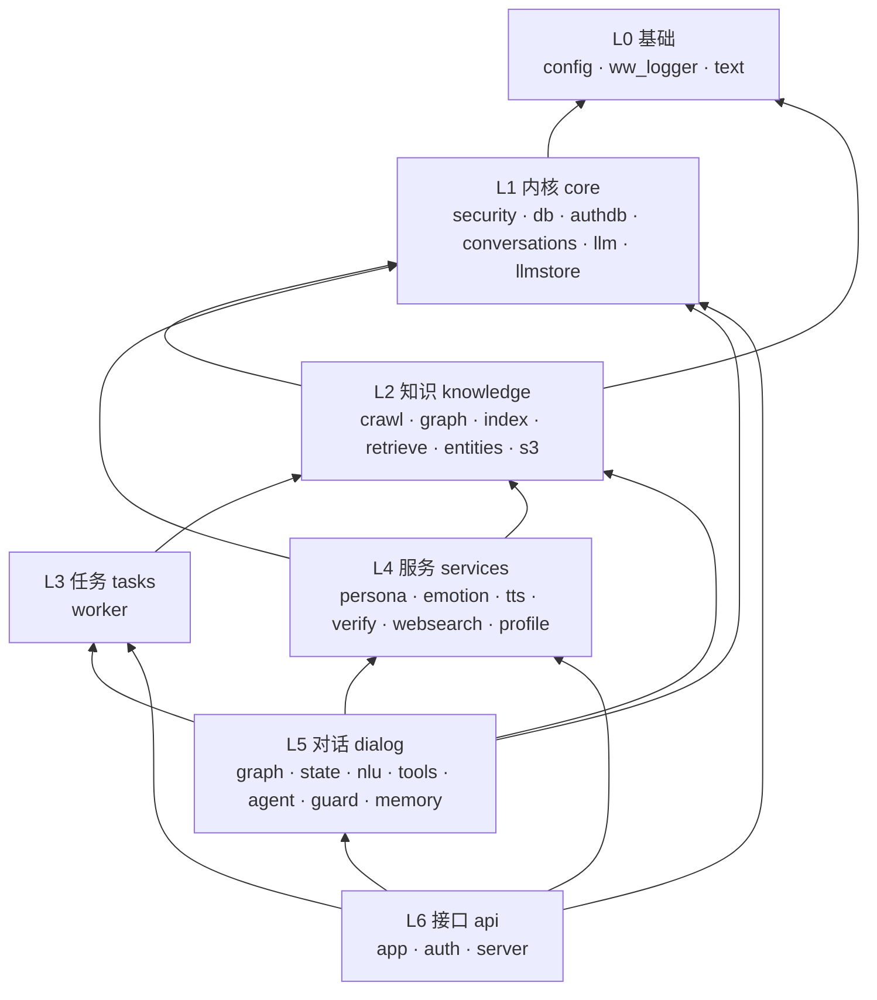

# 架构设计

> 面向第一次读这个仓库的人。读完这一篇，你应该能回答两个问题：
> **新代码该放哪个包**、**两个模块能不能互相 import**。
>
> 具体到某个函数为什么这么写、踩过什么坑，见本地开发笔记（不入库）。

---

## 1. 全景



箭头是**依赖方向**，一律从下往上读：上层可以调下层，下层永远不知道上层的存在。

---

## 2. 分层规则（本仓库唯一的铁律）

| 层 | 包 | 职责一句话 | 允许依赖 |
|---|---|---|---|
| L0 基础 | `config` `ww_logger` `text` | 配置、日志、纯文本工具。**零项目内依赖** | — |
| L1 内核 | `core` | 基础设施：口令哈希、PG 连接池、鉴权表、会话存储、LLM 客户端、凭据保险箱 | L0 |
| L2 知识 | `knowledge` | 语料与索引：爬取分块、图谱、BM25/向量索引、混合召回、角色名册、对象存储 | L0 L1 |
| L3 任务 | `tasks` | Celery worker：把 L2 的批处理串成 5 步链并上报进度 | L0 L1 L2 |
| L4 服务 | `services` | 单点能力：人格注入、情绪判定、语音合成、答案校验、联网兜底、用户画像 | L0 L1 L2 |
| L5 对话 | `dialog` | LangGraph 编排：NLU → 路由 → 检索 → 校验 → 生成，含记忆与防复读 | L0 L1 L2 L3 L4 |
| L6 接口 | `api` | FastAPI 路由、鉴权依赖、SSE 流式 | 全部 |

### 三条硬性约定

1. **依赖只向下**。跨层只允许「上层 → 下层」；同层之间可以互相 import。
   唯一的隔层边是 `dialog → tasks`（L5→L3，跳过 L4），用于「库外角色自动爬取」触发 5 步链——方向仍向下，合规。
2. **内部导入一律写绝对路径** `from wuwa_rag.<包>.<模块> import ...`。
   相对导入靠数点号层级，改结构时最容易数错；绝对导入本身就是架构文档，一行 import 就能读出依赖方向。
3. **不写循环导入**，连「延迟导入绕环」也不要。如果非要用延迟导入，说明分层错了，先改结构。
   （历史包袱 `authdb → api.auth` 就是这样消掉的：把口令哈希下沉到 `core/security.py`。）

### 守卫：让规则可执行

```bash
uv run python scripts/check_layers.py          # 违规时 exit 1
uv run python scripts/check_layers.py --dot    # 额外输出 Graphviz DOT
```

它按上面的分层表扫描全部内部导入，报告**分层方向违规**与**循环依赖**。
改完结构跑一次；接 CI 后可以作为提交门禁。当前状态：**49 个模块，132 条依赖边，0 违规，0 环**。

> 📌 2026-10-06：清掉了 2026-09-30 重构遗留的 5 个空壳包（`rag/` `graph/` `ingest/`
> `retrieval/` `storage/`，均只含 `__init__.py`、贡献 0 条依赖边，无任何代码引用），
> 守卫的模块计数因此由 54 回落到真实的 **49**（边数 132 不变）。
> 清理后已核验：9 个活跃包完好（含与旧 `wuwa_rag/graph` **同名但不同物**的
> `knowledge/graph`）、49 个模块全部可导入、5 个旧包名确认不可再导入、
> 42 个 py 文件语法编译通过。
>
> ⚠️ 脚本的模块数会把**只含 `__init__.py` 的空包**也计入，所以将来若再看到
> 「模块数 > 分层小计之和」，先查是不是又留下了空壳目录。

---

## 3. 各层详解

### L0 基础

| 模块 | 内容 |
|---|---|
| `config.py` | 全部配置项的唯一定义处（pydantic-settings 读根目录 `.env`）。采样参数、超时、阈值、`TZ_NAME` 都在这 |
| `ww_logger.py` | 跨进程安全日志。FastAPI 与 Celery 共写 `logs/rag.log`，靠 `concurrent-log-handler` 的文件锁，**不按 role 拆文件** |
| `text.py` | 纯函数：切块、embedding 输入构造、引用角标剥离、`AnswerFilter` 行级去重 |

### L1 内核 `core`

把「跟具体业务无关、但到处都要用」的东西收在这里。名字取自它服务的对象，而不是技术栈。

| 模块 | 内容 |
|---|---|
| `security.py` | 口令哈希：`hashlib.scrypt` + 常量时间比较。**放这里而不是 `api/auth.py`**，因为 `core/authdb` 种子管理员时也要用——留在 api 层会让 core 反向依赖 api |
| `db.py` | 业务库 PG 连接池（`psycopg_pool`），`get_cursor` / `close_pool` |
| `authdb.py` | 鉴权表 DDL、连接池、`ensure_schema`（建表 + 清过期 token + 种子 admin） |
| `conversations.py` | 会话与消息持久化（按用户隔离） |
| `llm.py` | **两个** LLM 客户端：`get_chat_llm()` = aemeath（只做最终作答）、`get_tool_llm()` = qwen3:8b（结构化抽取）。两者都 `bind(think=False)` |
| `llmstore.py` | 用户自带云端模型凭据的加密存储（KEK/DEK 两层，登录即解锁） |

### L2 知识 `knowledge`

「知道什么」全在这一层。三个子包按**数据形态**分，不按流程分：

```
knowledge/
├── crawl/    原始语料：      chunker.py（结构感知分块） · pipeline.py（PG+S3 落库）
├── graph/    结构化事实：    neo4j_client.py · extract.py（正则抽取） · build_graph.py
├── index/    检索索引：      bm25.py · embeddings.py（bge-m3） · rerank.py · build_index.py
├── entities.py   角色名册与别名归一（图谱名、队伍串都走这里）
│                 + **角色名提及判定的唯一实现** `find_mentions`（单字名走分词、多字名走正则；
│                   nlu / entities / graph 三处共用，别再各写一套）
├── retrieve.py   混合召回：dense(30) + sparse(30) → RRF(k=60) → rerank → top6
└── s3.py         RustFS/S3 抽象层（换后端只改这一层）
```

> **PG 是唯一真源**。Chroma、`bm25.pkl`、Neo4j 都是**可随时全量重建**的派生索引。

### L3 任务 `tasks`

| 模块 | 内容 |
|---|---|
| `worker.py` | Celery app + 5 步链 `crawl → chunk → ingest → index → graph` + 双通道进度上报 |

Windows 必须 `--pool=solo` 且并发 1：`chunk` 任务按角色整写 `chunks.jsonl`，并行会互相覆盖。

### L4 服务 `services`

**粒度是「一件事」，不是「一个实体」**——每个模块对外只暴露一两个动词。

| 模块 | 内容 |
|---|---|
| `persona.py` | 云端模型的人设注入（`SystemMessage`）；本地 aemeath 自带人设，**绝不可传 system** |
| `emotion.py` | 答案 → `[excited]` 等控制标签（供 TTS 用） |
| `tts.py` | Qwen-Audio-TTS 合成；`resolve(user_id)` 是凭据解析唯一入口（用户自持 > `.env` 兜底） |
| `verify.py` | 检索后校验「资料能否回答问题」，给不匹配分级升级 |
| `websearch.py` | 百度千帆联网兜底；`QIANFAN_API_KEY` 留空即整体关闭 |
| `profile.py` | 用户画像（user_facts）读写；同类事实**可更新**（`category` 列，昵称/水平覆盖，主玩角色等可多值事实叠加保留） |

### L5 对话 `dialog`

LangGraph 编排层，也是全项目最厚的一层。

| 模块 | 内容 |
|---|---|
| `graph.py` | **主编排**：`StateGraph` 定义、各节点、路由 `_route` / `_after_graph`、`ask` / `ask_stream`、确定性补料 |
| `prompt.py` | 提示词与上下文构建：`SYSTEM_PROMPT` 常量、`build_context`、`build_prompt`、`doc_sources` |
| `state.py` | `RagState` 类型定义（每轮必须清零的字段在这里注明） |
| `nlu.py` | 意图/槽位/属性/阶段正则（零 LLM）+ 追问改写 + 闲聊判定（`is_identity` 问助手身份 / `is_self_intro` 陈述用户自己，两条规则硬信号） |
| `tools.py` | 三个 `@tool`：`graph_search` / `vector_search` / `current_time` |
| `agent.py` | LLM 自主选工具（`bind_tools`）——**路径保留，主链未启用** |
| `guard.py` | 运行时行级复读检测与截断（含周期块循环判定） |
| `memory.py` | LangGraph checkpointer（PG `lg` schema），多轮记忆按 `thread_id` |

### L6 接口 `api`

| 模块 | 内容 |
|---|---|
| `app.py` | 全部路由：`/ask` `/ask/stream`(SSE) `/ingest` `/ingest/status` `/llm/*` `/tts` `/profile` `/admin/users` … |
| `auth.py` | 注册/登录/token 校验、`get_current_user` / `require_admin` 依赖 |
| `ratelimit.py` | 限流（slowapi）：`limit_auth` / `limit_ask` / `limit_tts` / `limit_outbound` 四档 + `install(app)` |
| `server.py` | uvicorn 启动入口（**唯一**需要 `SelectorEventLoop` 的 async 入口之一） |

---

## 4. 两条主链路

### 4.1 问答链路（`dialog/graph.py`）

```
intent ─┬─ chitchat ──────────────────────────────────┐
        ├─ time ──────────────────────────────────────┤
        ├─ fact     → graph            → verify ─┐    │
        ├─ semantic → vector           → verify ─┤    ├→ generate
        └─ hybrid   → graph → vector   → verify ─┘    │
                                                      │
verify 不通过时升级：重爬该角色 → 重检索 → 联网兜底 ────┘
```

- **意图层只决定「查什么」**：`fact` 走图谱、`semantic` 走向量、`hybrid` 两条都走。
- **`graph` 之后还有一层 `_after_graph`** 决定要不要补向量，两条硬规则：技能类强制补、指名队伍（≥3 角色）强制补。
- **`intent` 是对外字段，必须与实际路径一致**：不走向量就不能标记成 `hybrid`。
- **工具调用走 L1 确定性直调**（节点里 `await TOOL.ainvoke({...})`），不用 LLM 选工具：
  零幻觉、零额外延迟。`agent.py` 的 L2 路径保留作对照。
- **纯时间问题**（`intent=time`）不检索，取服务端真值后交模型用爱弥斯口吻说出；
  **顺带问时间**的游戏问题仍走检索，同时在 prompt 里补一句真值（`intent.mentions_time` 判定）。

### 4.2 入库链路（`tasks/worker.py`，Celery chain）

```
crawl_character → chunk_character → ingest_character → index_character → graph_character
  抓 wiki md       结构感知分块        PG + S3 落库        BM25 + Chroma      正则抽事实 → Neo4j
```

各步幂等、可单独重跑：`documents` 靠 `raw_sha256` DO UPDATE，`chunks` 靠 `chunk_id` DO NOTHING。
五步各自上报进度（Celery backend + Redis 聚合键双通道），`GET /ingest/status` 按角色查。

---

## 5. 关键设计决策

| 决策 | 理由 | 代价 |
|---|---|---|
| **PG 是唯一真源**，Chroma/BM25/Neo4j 全是派生 | 索引可以随时重建，不用怕「索引和真数据不一致」 | 建索引要跑一遍全量 |
| **bge-m3 / reranker 走 CPU** | 8 GB 显存留给 LLM；embedding 用 CPU 只慢一点，LLM 换出去就慢很多 | 检索慢几秒 |
| **`SelectorEventLoop` + `psycopg`**，不用 `asyncpg` | psycopg 的异步实现落在 uvicorn 自起的 Proactor loop 会上报连接池初始化超时 | 每个 async 入口都要显式传 `loop_factory` |
| **两个 8B 模型分工**（aemeath 作答 / qwen3:8b 抽取） | 结构化任务要稳定 JSON，作答要人设 | 8 GB 显存装不下两个，会来回换出（单轮 2~3 次，每次约 3s） |
| **工具调用走 L1 确定性直调** | qwen3:8b 自主选工具会漂移参数名（实测把 `characters` 写成 `character`，随后编造数据） | 新增工具要手写路由 |
| **内部导入全用绝对路径** | 相对导入数点号最容易错；绝对路径自带依赖信息 | 行更长 |
| **口令哈希下沉 `core/security.py`** | 消掉 `core → api` 的反向依赖 | 多一个小文件 |

---

## 6. 外部依赖与数据落点

| 组件 | 用途 | 落点 / 配置 |
|---|---|---|
| PostgreSQL (pgvector16) | 业务真源 + LangGraph checkpointer | `pgsql/001_init.sql`；DSN 见 `.env` |
| Neo4j 5.26 | 结构化事实图谱 | 全部 MERGE 幂等，约束见 `knowledge/graph/neo4j_client.py` |
| Redis | Celery broker/backend + 进度聚合键 | — |
| RustFS (S3 兼容) | 原文 md + 立绘 | `knowledge/s3.py` 抽象层 |
| Chroma | bge-m3 稠密向量 | `data/chroma/chroma/` |
| Ollama `aemeath` | 最终作答模型（QLoRA 微调 Qwen3-8B） | 人设由 Modelfile 自带 |
| Ollama `qwen3:8b` | 结构化抽取、校验、改写 | `think=False` |

---

## 附录 A：2026-09-30 结构重构对照

重构前是 5 个平级技术包（`rag/` `graph/` `retrieval/` `ingest/` `storage/`）+ 6 个顶层模块，
`rag/` 一个包里混了 LLM 客户端、检索器、人格、TTS、编排、状态等六种性质的东西。
重构按**职责与变化原因**重划边界，`rag/` 拆成 4 个包；文件只搬家与改导入行，**未动任何函数体**
（`api/auth.py` 的口令哈希下沉是唯一例外，已单独说明）。

| 旧 | 新 | 旧 | 新 |
|---|---|---|---|
| `db.py` | `core/db.py` | `rag/chain.py` | `dialog/graph.py` |
| `authdb.py` | `core/authdb.py` | `rag/state.py` | `dialog/state.py` |
| `conversations.py` | `core/conversations.py` | `rag/intent.py` | `dialog/nlu.py` |
| `rag/llm.py` | `core/llm.py` | `rag/loopguard.py` | `dialog/guard.py` |
| `rag/llmstore.py` | `core/llmstore.py` | `rag/tools.py` | `dialog/tools.py` |
| `rag/persona.py` | `services/persona.py` | `rag/agent.py` | `dialog/agent.py` |
| `rag/emotion.py` | `services/emotion.py` | `rag/memory.py` | `dialog/memory.py` |
| `rag/tts.py` | `services/tts.py` | `graph/neo4j_client.py` | `knowledge/graph/neo4j_client.py` |
| `rag/verify.py` | `services/verify.py` | `graph/extract.py` | `knowledge/graph/extract.py` |
| `rag/websearch.py` | `services/websearch.py` | `graph/build_graph.py` | `knowledge/graph/build_graph.py` |
| `rag/profile.py` | `services/profile.py` | `ingest/chunker.py` | `knowledge/crawl/chunker.py` |
| `rag/retrievers.py` | `knowledge/retrieve.py` | `ingest/pipeline.py` | `knowledge/crawl/pipeline.py` |
| `rag/characters.py` | `knowledge/entities.py` | `retrieval/bm25.py` | `knowledge/index/bm25.py` |
| `storage/s3.py` | `knowledge/s3.py` | `retrieval/embeddings.py` | `knowledge/index/embeddings.py` |
| `worker.py` | `tasks/worker.py` | `retrieval/rerank.py` | `knowledge/index/rerank.py` |
| | | `retrieval/build_index.py` | `knowledge/index/build_index.py` |

`git mv` 搬迁，历史完整保留。

> 📌 上表**左列的旧路径现已全部不存在**：搬迁时留下的 5 个空壳包（`rag/` `graph/`
> `ingest/` `retrieval/` `storage/`，只余 `__init__.py`）已于 2026-10-06 清理。
> 在此之前它们让架构守卫的模块计数虚增 5（54 vs 真实的 49）。
> ⚠️ 注意 `wuwa_rag/graph`（旧空壳，已删）与 `wuwa_rag/knowledge/graph`（现役 L2 子包，
> 含 `extract.py` / `neo4j_client.py` / `build_graph.py`）**同名但完全不同物**。
